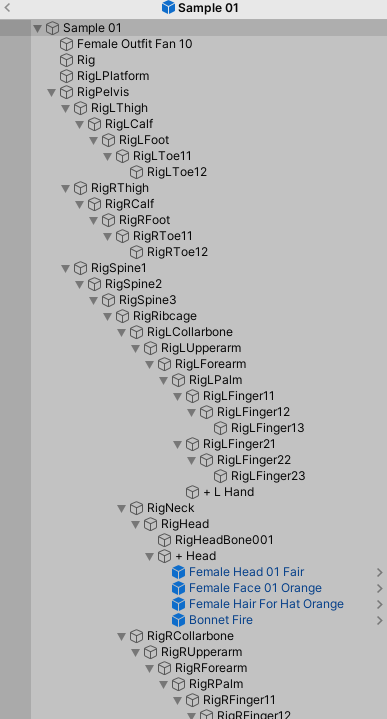
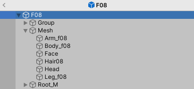
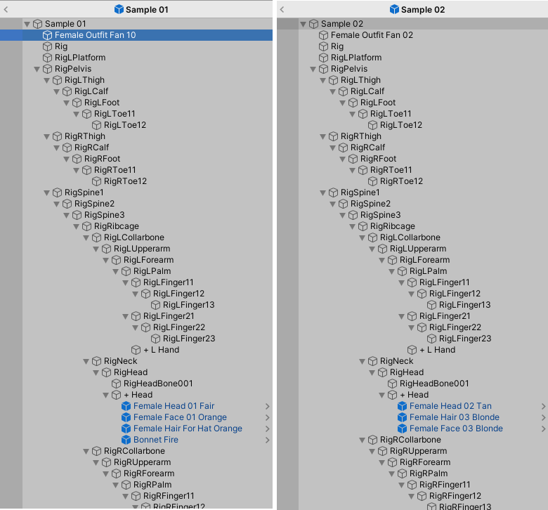
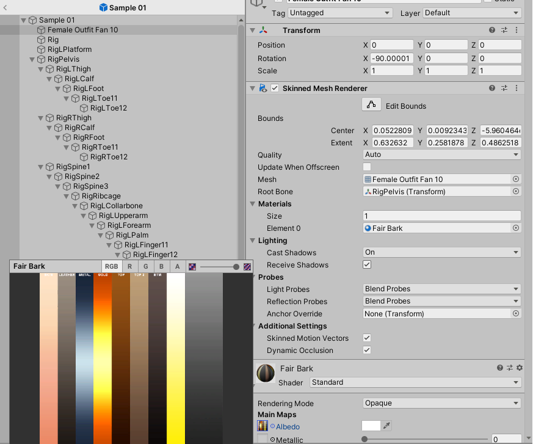
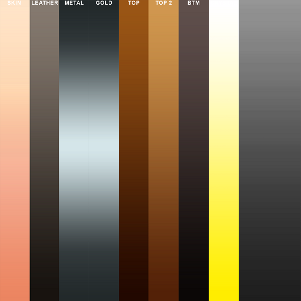
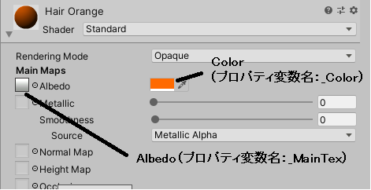
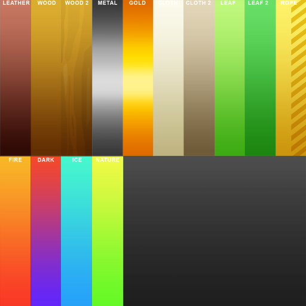

# 3Dモデルの内容の確認 - Cute Series (MESHTINT)

- [目次へ](./index.md)

## 作成済みプレハブの確認

プレハブを確認すると、上のようになっている。これは一般的な（？）3Dモデルの構造と異なる。

一般的な人型3Dモデルの構造は、

このように、ボーン（リグ）系のルート（ここでは「Root_M」）とメッシュ系のルート（ここでは「Mesh」）がある。

しかし、Cute Seriesのモデルの場合、メッシュは、ルート（ここでは「Female Outfit Fan 10」または「Female Outfit Fan 02」）に1つだけあり、更にリグ系のツリーの中にも「Female Head 01 Fair」などのメッシュがある。

後ほど試すが、Cute Seriesでは、「素体」と「パーツ」があってそれぞれを複数種類から選べるようになっている。ルートに1つあるメッシュが「素体」、リグ系のツリーの中に点在するメッシュが「パーツ」に相当する。

## マテリアル

素体のマテリアルは1つのみで、Standardシェーダを用いている。

それでどうやって色を分けているかと言うと、Albedoに割り当てられているテクスチャが
縦縞のような不思議なテクスチャで、パーツごとにどの位置の色を参照するか（U座標）が決まっており、
濃淡をV座標で表現している。

これによって、色違いのキャラをより簡単に作れるようにしている。

テクスチャはpsdファイルで、2048×2048ピクセル。

横方向に10個に分割されており、「SKIN」「LEATHER」「METAL」「GOLD」「TOP」「TOP2」「BOTTOM」「CRYSTAL」と書かれ、右2つ分は何もない。

また、SKINとMETALの色は（肌の色が同じであれば）共通であり、色によってTOPやTOP2、つまり服の色が変わるようになっている。一方、Color（Albedoの右にある色）は白であり、テクスチャの色がそのまま反映されるようになっている。

「Standard Assets Files」→「Textures」および「Addon Textures Pack 01」フォルダ内にテクスチャがあり、
「Fair」と「Tan」で始まるファイル名はすべてこの構造である。

### 顔のマテリアル

「Face」で始まるファイルには顔の絵が描かれている。

「Famale Face.fbx」（マテリアル未設定）のマテリアルに顔のテクスチャを割り当てたマテリアルを設定することで
顔を表現している。

Colorは同じく白である。

### 髪のマテリアル

「Hair」で始まるマテリアルには、Albedoとして「Hair Dark」または「Hair Light」の、縦方向のグラデーションのみのテクスチャが割り当てられている。

これだけでは髪の色が表現できないが、Colorが髪の色になっている。

（「Albedo」という文字の左にあるのがメインテクスチャ、右にあるのが色である）

### 持ち物のマテリアル

持ち物には「Weapons And Props」という（やはり単一の）マテリアルが割り当てられている。

このテクスチャも他と同様、縦縞のテクスチャとなっているが、
色を変更することは想定していないようだ（もちろん変更すること自体は可能）。

- [目次へ](./../index.md)

