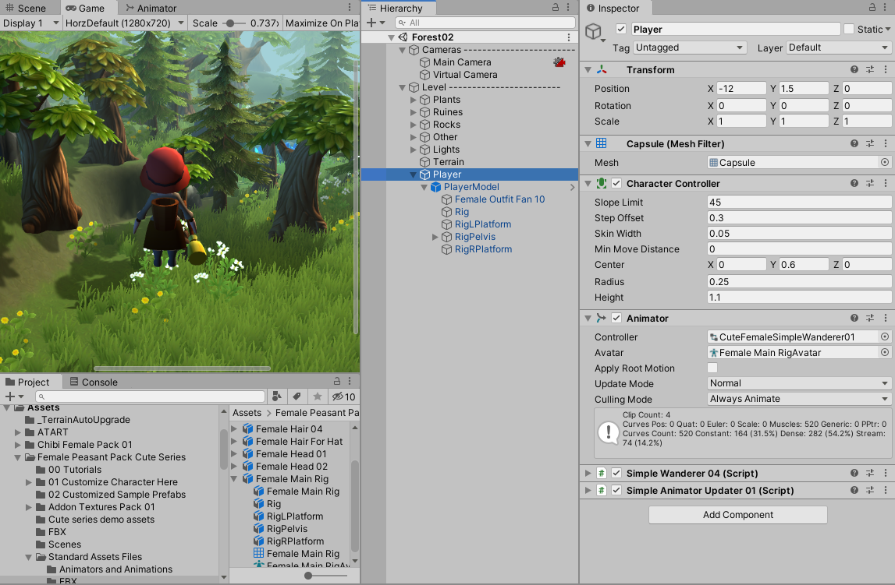

# とりあえず使ってみる - Cute Series (MESHTINT)

- [目次へ](./../index.md)

[こちらのページ](https://takanashi1443.github.io/dev_note/template/)の「とりあえずキャラクターで3D空間を動けるようにする」を参照する。

空のGameObject「Player」を作成し、

- Capsule Collider
- Character Controller (移動処理を簡易的にやってくれるスクリプト)
- Animator (アニメーション方法を指定)
    - ControllerにCuteFemaleSimpleWanderer01を指定
    - AvatarにFemale Main RigAvatar（後述）を指定
- Simple Wanderer 04
- Simple Animator Updater 01

をアタッチする。

（Capsule ColliderとCharacter Controllerの設定はリンク先を参照）

（CuteFemaleSimpleWanderer01はShibaTemplate→Modules→Wanderer→SimpleWanderer→Controllersにある）

「02 Customized Sample Prefabs」フォルダ内の「Sample 01」をPlayerの子としてD&Dし、
名前を「PlayerModel」に変更する。

PlayerModelにアタッチされているAnimatorのAvatarには「Female Main RigAvatar」が設定されているので、
それをPlayerのAvatarにセットする。

適当な3D空間に置いて再生する。

方向キーで移動させることができ、歩行とジャンプのアニメーションを行う。

- [目次へ](./../index.md)

