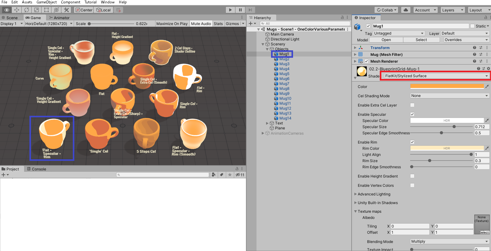

# Flat Kit: Toon Shading and Water

- [1つ上へ](./../index.md)

## 概要

トゥーンシェーディングなどのシェーダのアセット。

シェーダ系アセットの中でも人気が高く、理解しやすいのではないかと考えている。

ここではこのアセットの内容を把握して、Cute Seriesなどのテクスチャを差し替えるなどして
使えそうなシェーダを、使い方も含めて理解することを目的としている。

## 概要

FlatKit/Stylized Surfaceのシェーダを最もよく使う。

これに様々な設定を行って表示方法を変える。
上図のマグカップは右上のアウトラインつきのもの以外すべてStylized Surfaceである。

テクスチャを使用しなくても様々な陰影がつけられるのが売りだが、Standard Shaderの_MainTexについてはFlatKit/Stylized Surfaceに変更してもちゃんとFlatKitっぽくなる。

## 使用例

