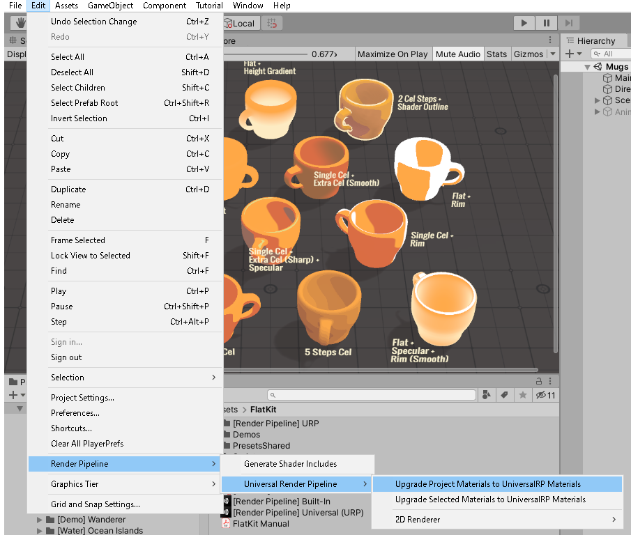

# はじめに - Unityのアセット

- [目次へ](./index.md)

## はじめに

- Unityのバージョンは 2019.4.24f1を基本とする。
- テンプレートとして「Universal Rendering Pipeline」を使用する。

## URPへの対応

### 標準シェーダの対応

URP非対応のシェーダを使用したアセットの場合、
インポート直後はマテリアルがURP非対応のものなので全部ピンクになる。

テンプレートとして「Universal Rendering Pipeline」を使用している場合、

「Edit」→「Render Pipeline」→「Universal Rendering Pipeline」→「Upgrade Project Materials To UniversalRP Materials」

でプロジェクト内のマテリアルにセットされている標準シェーダ（例としてStandard Shader）を一括してURPの対応するものに変換できる。

具体的な変換は以下の通り。

-「Standard」→「Universal Rendering Pipeline/Lit」

### 各アセット（ツール系・学習を要するもの）の対応

「3D素材」のアセットについては必要に応じて各アセットで説明する。

#### Cute Series(MESHTINT)

上記の標準シェーダの対応を行う。

#### Flat Kit

アセットをインポートすると「[Render Pipeline] Built-In.unitypackage」と「[Render Pipeline] Universal(URP).unitypackage」がある。

古いバージョンのUnity(2019.4.9)でインポートした時はこうならなかったので、ある程度新しいUnityである必要があると思われる。

URPの方をダブルクリックするとURP用のシェーダが展開される。

